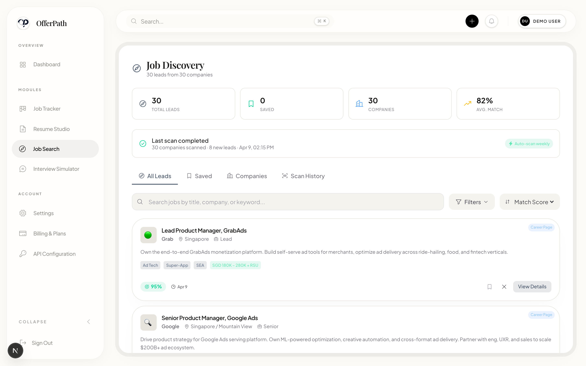
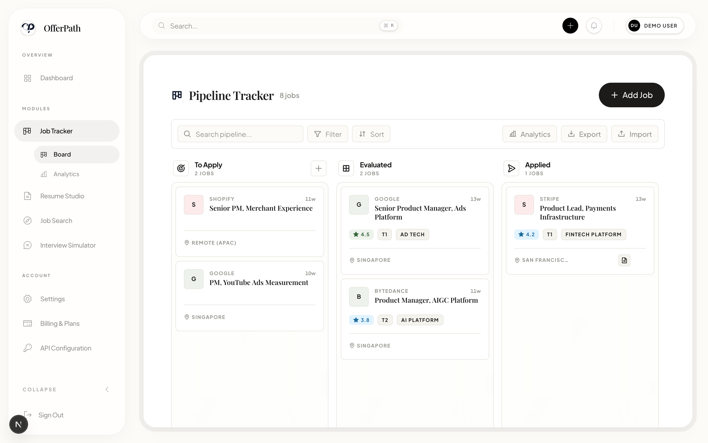
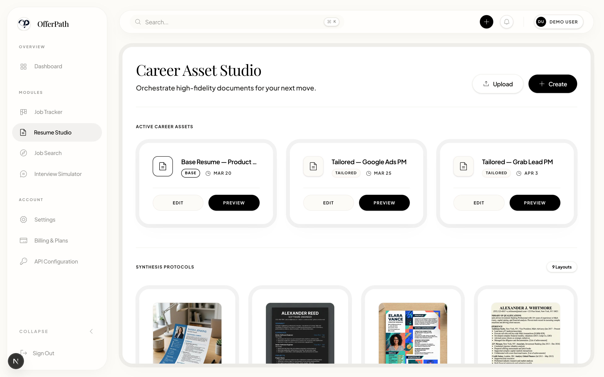
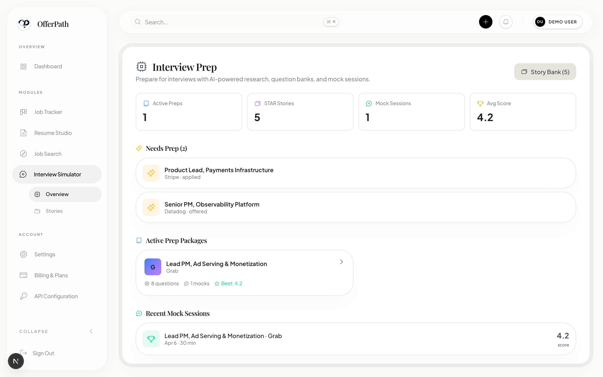
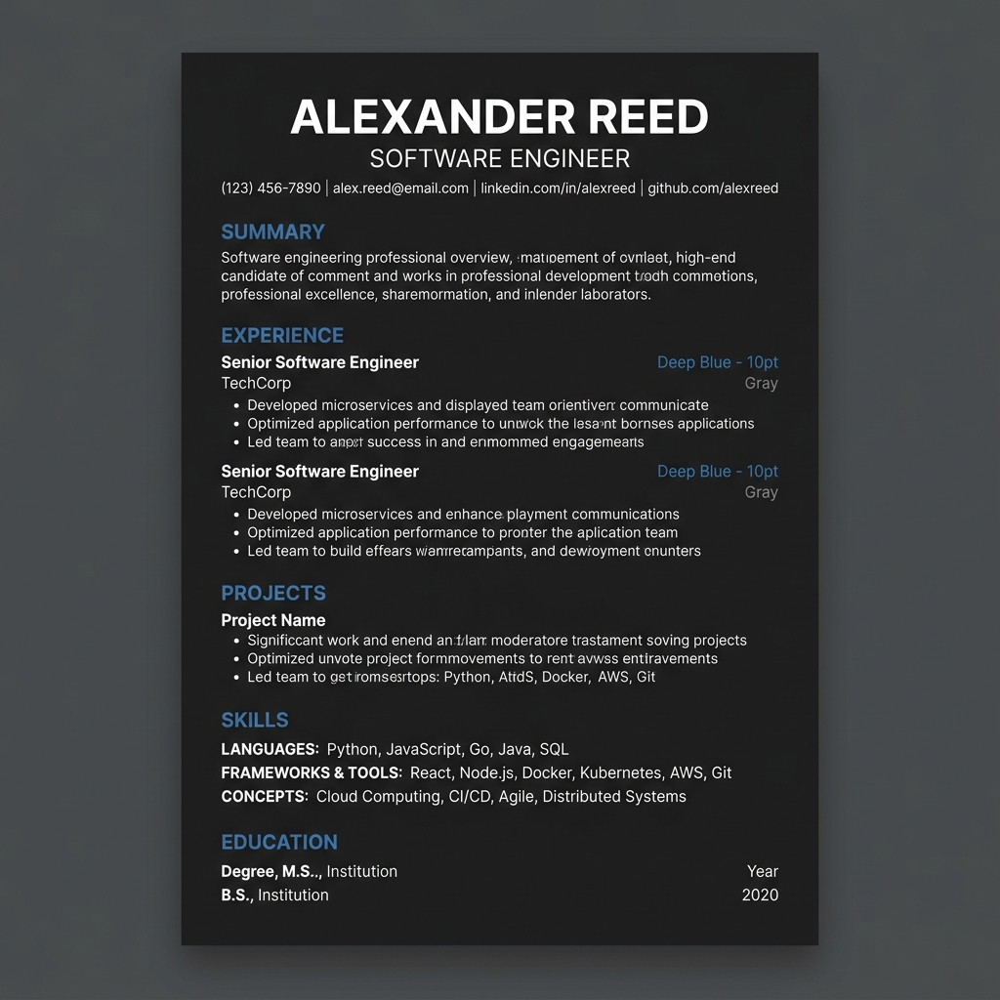
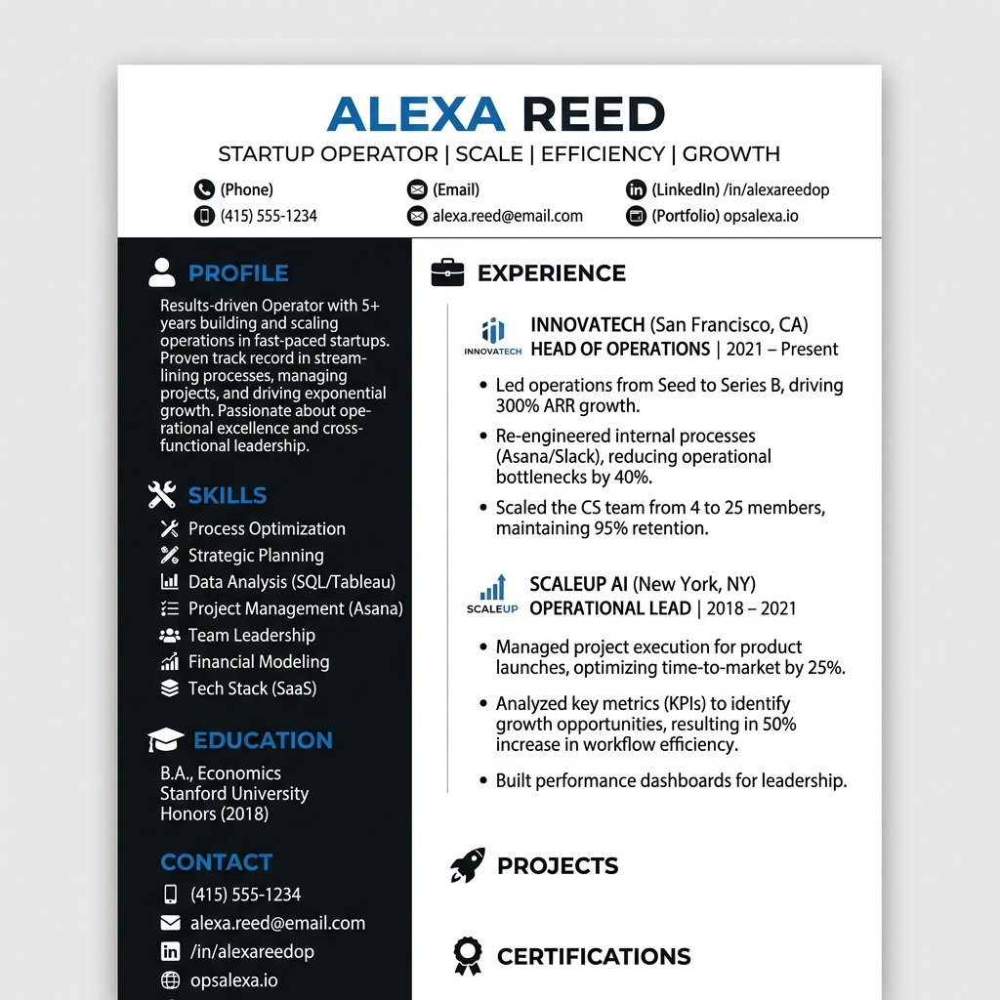
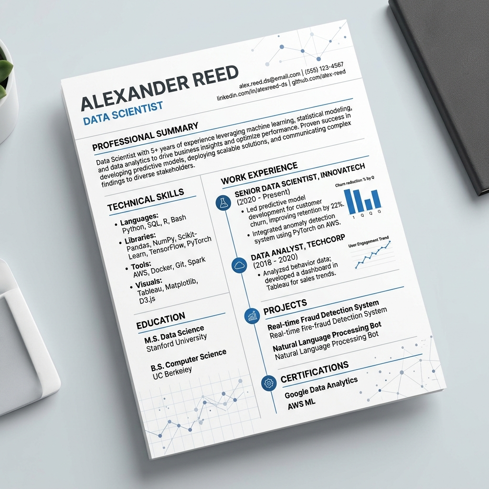
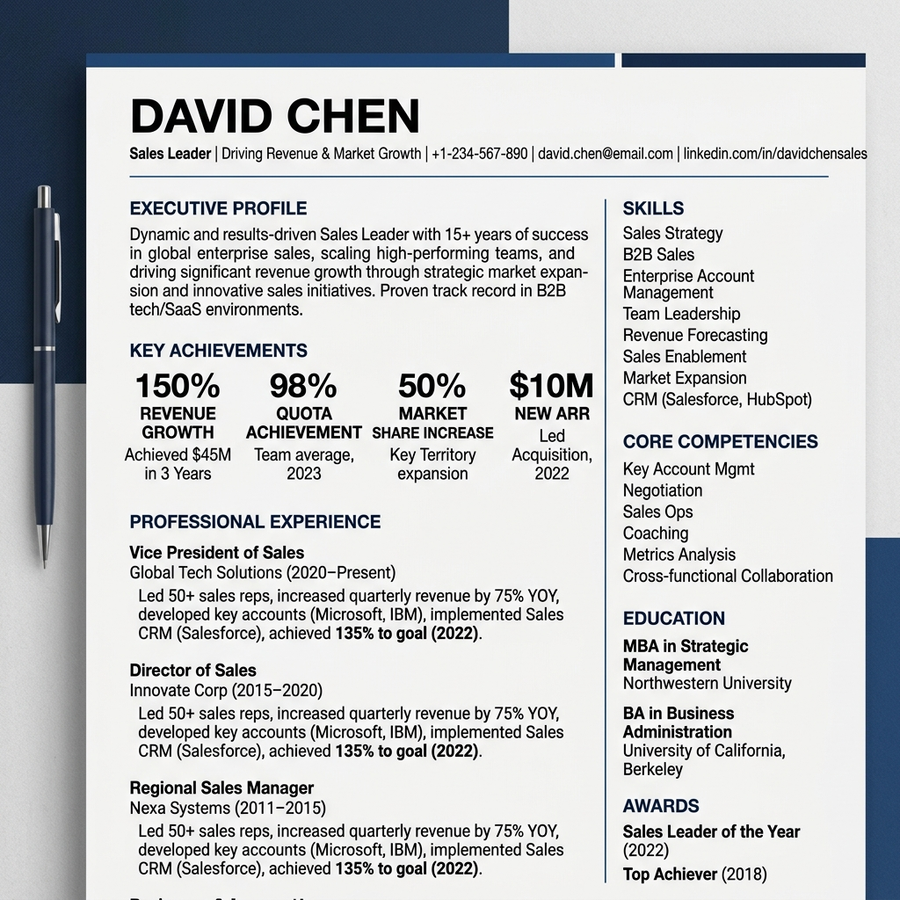

<div align="center">
  

  <h1>OfferPath</h1>
  <p><strong>The career operating system for serious job seekers.</strong></p>

  <p>
    <a href="https://vercel.com/alexjiaguos-projects/offerpath"><strong>Live Demo</strong></a>
    &nbsp;·&nbsp;
    <a href="#key-capabilities"><strong>Capabilities</strong></a>
    &nbsp;·&nbsp;
    <a href="#template-gallery"><strong>Templates</strong></a>
    &nbsp;·&nbsp;
    <a href="#quick-start"><strong>Get Started</strong></a>
  </p>
</div>

<br/>

## Why OfferPath

The modern job search is a data-heavy, high-stakes project, and it's poorly served by spreadsheets, scattered docs, and a dozen half-built tools. OfferPath treats the search like the work it actually is: structured, measurable, and AI-augmented from end to end.

- **End-to-end loop** — Discovery → Tailoring → Application → Interview → Offer, in one product. No other tool closes this loop.
- **AI anchored to your own data** — every score, summary, and mock question is generated from your base resume, base stories, and the live JD.
- **BYOK, no vendor lock-in** — bring your own OpenAI, Anthropic, Google, or DeepSeek key. Switch providers anytime; nothing is locked to a single model.
- **Outcomes, not promises** — tailoring 45m to 90s, interview-rate lift 18% to 32% (PRD baseline targets).

<br/>

<a id="key-capabilities"></a>

## Key Capabilities

The dashboard is the hub. Four modules, one workspace, shared state across every artifact.

<div align="center">
  
</div>

<br/>

### 1. Job Discovery

A scheduled Smart Feed across 30+ target companies, match-scored against your profile, one click from the feed to a tracked application.

- **Smart Feed** — 30 leads from 30 companies, auto-refreshed weekly.
- **Match scoring** — every lead surfaces fit %, salary range, and tags in one row.
- **One-click promote** — send a lead to the pipeline without retyping the JD.

<div align="center">
  
</div>

<br/>

### 2. Job Tracker

A kanban pipeline built for the messiness of a real search. Drag applications through stages; let AI score every JD against your resume as it lands.

- **5-stage kanban** — To Apply, Evaluated, Applied, Interviewing, Offer (+ Archived).
- **JD analysis on add** — fit score, must-have vs. nice-to-have, one-line "why this might be a fit."
- **Funnel analytics** — application-to-interview conversion at a glance.

<div align="center">
  
</div>

<br/>

### 3. Resume Studio

Nine meticulously designed templates, an editor that knows what a JD is asking for, and AI tailoring that rewrites your bullets for the role you're applying to, not the role you applied to last week.

- **9 templates** — from ATS-strict classics to design-forward portfolios.
- **AI tailoring** — rewrites summary + bullets for each JD, keeps your voice.
- **One-click export** — perfect PDF or DOCX, no watermarks, no email gate.

<div align="center">
  
</div>

<br/>

### 4. Interview Prep

Practice before the calendar invite. Build a STAR story bank once; deploy it as role-specific prep guides, company briefs, and AI mock sessions for every active application.

- **STAR Story Bank** — write each story once, deploy it everywhere.
- **AI mock sessions** — scored feedback on every answer, not vibes.
- **Company research** — generated briefs for every active role in the pipeline.

<div align="center">
  
</div>

<br/>

<a id="template-gallery"></a>

## Template Gallery

Nine resume templates, all ATS-friendly, all editable in the same Studio. From classic banker formats to bold creative portfolios.

<div align="center">

| | | |
| :---: | :---: | :---: |
| <br/><sub><b>Classic Blue</b></sub> | <br/><sub><b>Modern Sidebar</b></sub> | <br/><sub><b>Creative Portfolio</b></sub> |
| <br/><sub><b>ATS Classic</b></sub> | <br/><sub><b>Dark Engineering</b></sub> | <br/><sub><b>Academic CV</b></sub> |
| <br/><sub><b>Data Pro</b></sub> | <br/><sub><b>Bold Marketing</b></sub> | <br/><sub><b>Executive Navy</b></sub> |

</div>

<br/>

## Tech Stack

Built for speed, scale, and a quiet, premium UX.

| Layer | Choice |
| --- | --- |
| Framework | [Next.js 15](https://nextjs.org/) App Router · React 19 |
| Styling | [Tailwind CSS 4](https://tailwindcss.com/) · [Framer Motion](https://www.framer.com/motion/) · [Phosphor Icons](https://phosphoricons.com/) |
| Editor | [TipTap](https://tiptap.dev/) with custom AI extensions |
| Database & Auth | [Supabase](https://supabase.com/) (Postgres + RLS + Auth) |
| Charts | [Recharts](https://recharts.org/) |
| Drag & Drop | [dnd-kit](https://dndkit.com/) |
| State | [Zustand](https://github.com/pmndrs/zustand) (persisted) |
| Deployment | [Vercel](https://vercel.com/) |
| Testing | [Vitest](https://vitest.dev/) · [Testing Library](https://testing-library.com/) |

<br/>

<a id="quick-start"></a>

## Quick Start

### Local Development

```bash
# 1. Clone
git clone https://github.com/alexjiaguo/offerpath.git
cd offerpath

# 2. Install
npm install

# 3. Configure environment
cp .env.example .env.local
# Edit .env.local — at minimum, set NEXT_PUBLIC_APP_URL.
# Supabase is optional in dev: without it, OfferPath runs in
# mock-auth mode (localStorage + auth_token cookie).

# 4. Run
npm run dev
```

Open [http://localhost:3000](http://localhost:3000) to view it in the browser.

### One-Click Deploy

The fastest way to get a hosted copy is via Vercel. The repo is wired to deploy on every push to `main`.

<div align="center">
  <a href="https://vercel.com/new/clone?repository-url=https%3A%2F%2Fgithub.com%2Falexjiaguo%2Fofferpath&env=NEXT_PUBLIC_SUPABASE_URL,NEXT_PUBLIC_SUPABASE_ANON_KEY,NEXT_PUBLIC_APP_URL&envDescription=Supabase%20project%20URL%20%2B%20anon%20key%2C%20and%20the%20public%20app%20URL.&envLink=https%3A%2F%2Fsupabase.com%2Fdashboard%2Fproject%2F_%2Fsettings%2Fapi">
    
  </a>
</div>

You'll need a [Supabase](https://supabase.com/) project for production — apply the schema in [`supabase/schema.sql`](supabase/schema.sql) and add the URL + anon key to your Vercel env vars. AI provider keys (OpenAI, Anthropic, Google, DeepSeek) are configured per-user inside the app under **Settings -> API Configuration**.

### Verifying the Build

```bash
npm run lint        # ESLint
npm run build       # Next.js production build
npm test            # Vitest unit tests
```

<br/>

## Project Structure

A bounded-context layout that keeps each module self-contained.

```
src/
  app/                # Next.js App Router
    (auth)/           # Login, register
    dashboard/        # Authed workspace
      discover/       # Job discovery module
      pipeline/       # Tracker + analytics
      resume/         # Resume studio
      interview/      # Interview prep
    api/              # Server actions + route handlers
  components/         # Shared UI
  lib/                # Auth, Supabase, AI adapters
  store/              # Zustand stores (persisted)
  types/              # Shared TS types
supabase/             # schema.sql + migrations
public/               # Static assets + docs screenshots
```

<br/>

## See it live

[offerpath on Vercel](https://vercel.com/alexjiaguos-projects/offerpath) — full workspace with the four modules wired end-to-end.
