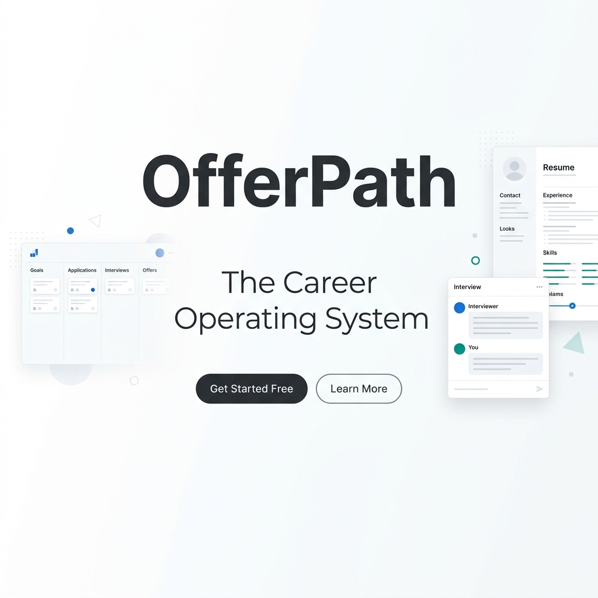
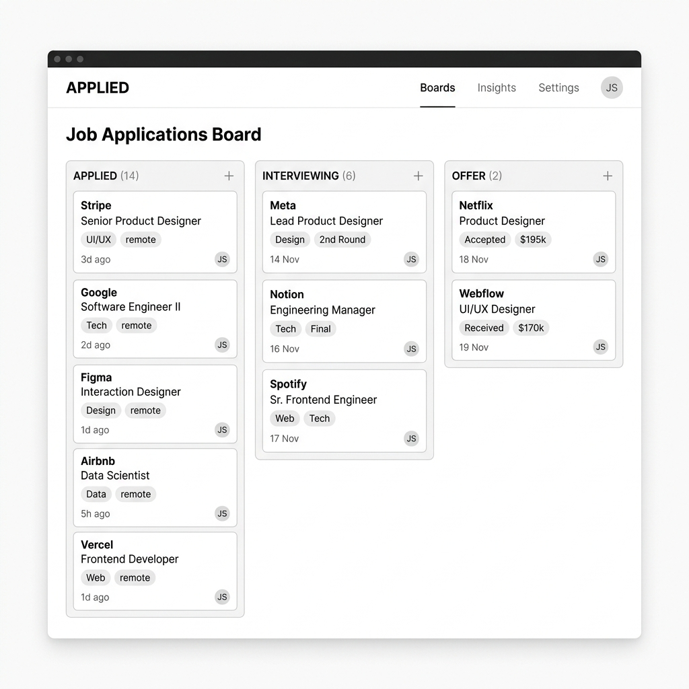

<div align="center">
  

  <h1>OfferPath</h1>
  <p><strong>The Career Operating System</strong></p>
  
  <p>
    A premium, utilitarian workspace designed to automate the friction of your career search. Land your dream offer with AI-driven pipelines, tailored resumes, and intelligent interview prep.
  </p>

  <div>
    <a href="https://offerpath-ubkywtxwz.vercel.app"><strong>View Live Demo</strong></a> ·
    <a href="#key-features"><strong>Explore Features</strong></a> ·
    <a href="#getting-started"><strong>Getting Started</strong></a>
  </div>
</div>

<br />

## 🌟 Why OfferPath?

The modern job search is a data-heavy, high-stakes project. OfferPath treats it like one. Built with a sleek minimalist aesthetic, it replaces chaotic spreadsheets and scattered docs with a unified, AI-powered command center.

<div align="center">
  
</div>

<br />

## 🚀 Key Features

### 📋 Intelligent Job Tracker
Stop losing track of your applications.
- **Kanban Pipeline**: Visually drag and drop applications through stages (Applied → Interviewing → Offer).
- **JD Analysis**: AI automatically analyzes job descriptions to score your fit and prioritize your next move.
- **Deep Analytics**: Track your funnel conversion rates from application to offer.

### 📝 AI Resume Studio
Build stunning, ATS-optimized resumes in minutes.
- **Dynamic Tailoring**: Use AI to perfectly tailor your summary and experience bullet points for every specific role you apply to.
- **Premium Templates**: 9 meticulously designed templates that pass ATS scanners while looking world-class.
- **1-Click Export**: Generate perfect PDFs instantly.

### 🎯 Interview Simulator
Master your interviews before they happen.
- **Mock Sessions**: Practice with simulated, AI-driven technical and behavioral interviews.
- **STAR Story Bank**: Build a reusable vault of your best career stories, automatically formatted into Situation, Task, Action, Result.
- **Company Research**: Generate instant briefing docs on your target companies.

### 🧭 Smart Job Discovery
Let the opportunities find you.
- **Smart Feed**: Discover matching opportunities across the web based on your unique profile.
- **Keyword Match**: Instant highlights of required skills you possess versus skills you need to brush up on.

## 🛠 Tech Stack

Built for speed, scale, and a premium UX:
- **Framework**: [Next.js 15](https://nextjs.org/) (App Router)
- **Styling**: [Tailwind CSS 4](https://tailwindcss.com/) & [Framer Motion](https://www.framer.com/motion/)
- **Database & Auth**: [Supabase](https://supabase.com/)
- **Deployment**: [Vercel](https://vercel.com/)

## 🚦 Getting Started

### Local Development

1. **Clone the repository**
   ```bash
   git clone https://github.com/alexjiaguo/offerpath.git
   cd offerpath
   ```

2. **Install dependencies**
   ```bash
   npm install
   ```

3. **Configure Environment**
   Duplicate `.env.example` to `.env.local` and add your Supabase credentials:
   ```env
   NEXT_PUBLIC_SUPABASE_URL=your_supabase_url
   NEXT_PUBLIC_SUPABASE_ANON_KEY=your_supabase_anon_key
   ```

4. **Run the development server**
   ```bash
   npm run dev
   ```
   Open [http://localhost:3000](http://localhost:3000) to view it in the browser.

---
<div align="center">
  <p>Built with ❤️ for ambitious professionals.</p>
</div>
