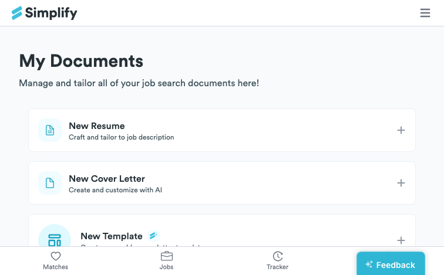
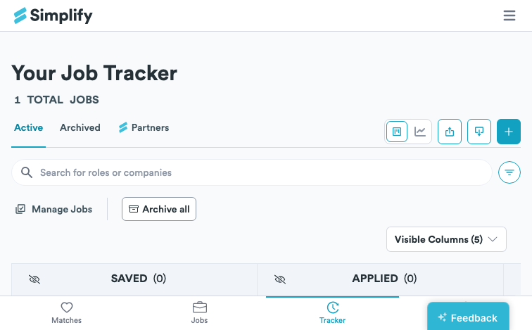
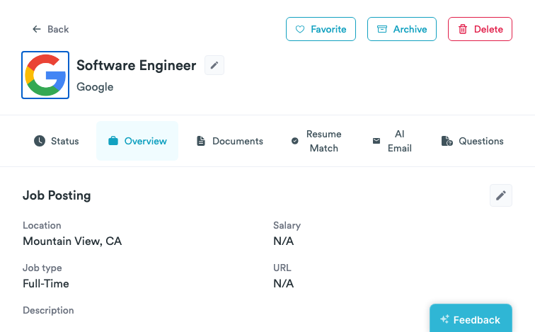
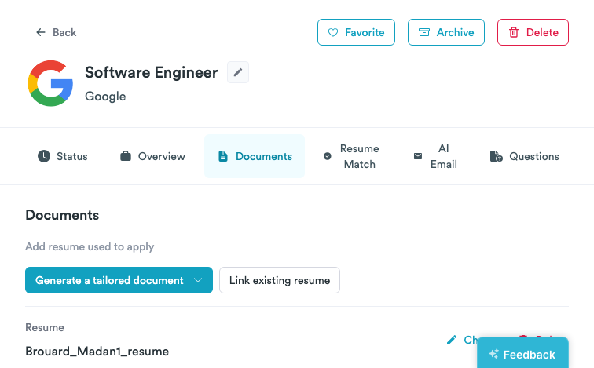
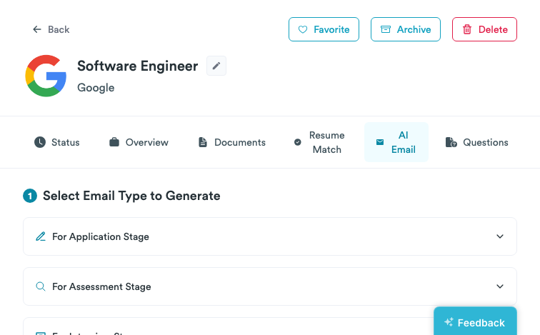
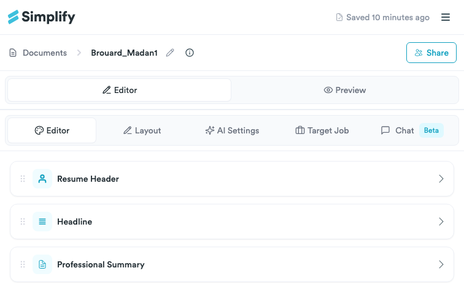
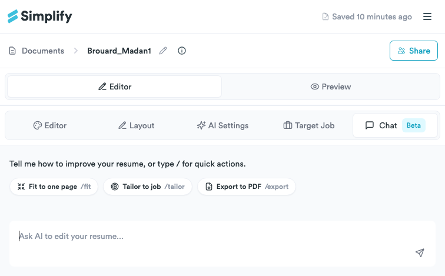

# Simplify.jobs Deep Feature & UI Audit

**Date:** May 21, 2026  
**Workspace:** [Offerpath](/Volumes/Download/ai-projects/side-hustles/job-hunt-os/products/offerpath)  

---

## 1. Document Management Dashboard (`/documents`)

The Documents Dashboard acts as a centralized repository where users manage their resume variations, cover letters, and reuse templates.

### UI & Layout Aesthetics
- **Header Navigation**: Fixed header with a clean border (`border-b border-gray-200`) containing the Simplify Logo (left-aligned) and quick navigation links (`Matches`, `Jobs`, `Tracker`, `Profile`) on the right.
- **Header Typography**: Primary page header "My Documents" is set in a bold, modern sans-serif font (Inter/Outfit) with a secondary font description: "Manage and tailor all of your job search documents here!".
- **Action Buttons Layout**: Two prominent call-to-action (CTA) buttons at the top right of the dashboard content area:
  - **New Resume**: Flex container with "New Resume" in bold text and subtitle "Craft and tailor to job description".
  - **New Cover Letter**: AI-driven tool with "New Cover Letter" in bold and subtitle "Create and customize with AI".
  - Secondary buttons below for "New Template" (reusable cover letter templates) and "Question Response" (generates responses to job application questions).
- **Document List Grid**:
  - Documents are presented in a structured list/table format with a checkbox on the left to allow batch operations (like deleting multiple files).
  - List columns: `RESUME NAME`, `TYPE` (e.g., Uploaded, Generated), `MODIFIED DATE`, and `ACTIONS`.
  - Individual entries feature clean hover highlights and an **Open Resume Actions** vertical ellipsis (`⋮`) button opening a popover menu (View, Rename, Download, Set as Default, Delete).

### Core Mechanics & User Flow
1. **Resume Customization Entrypoint**: Clicking "New Resume" initiates a dialog offering a choice to import details from the profile or clone an existing resume.
2. **Uploaded vs. Generated Resumes**: Uploaded Resumes (marked as "Uploaded") are static PDF templates that are processed for autocomplete parsing, whereas Generated Resumes (marked as "Generated") are editable within Simplify's interactive builder.

---

## 2. Job Tracker Dashboard (`/tracker`)

The Job Tracker is a fully featured applicant tracking system (ATS) layout optimized for drag-and-drop workflow monitoring.

### Kanban Board Layout & Aesthetics
- **Column Pipelines**: Standard job hunt stages are split into 5 vertical columns:
  - **Saved**: For jobs the user intends to apply to.
  - **Applied**: Active applications submitted.
  - **Interviewing**: Ongoing interviews.
  - **Offer**: Received offers.
  - **Rejected**: Closed opportunities.
- **Card Design**:
  - Cards feature a border-radius of `rounded-md`, clean shadows (`shadow`), and white backgrounds (`bg-white`).
  - Company logo on the left (fetched dynamically, with a loading placeholder pulse state if not yet loaded).
  - Title and company name stacked vertically on the right.
  - Quick action buttons (favorite heart icon, archive/delete options).
  - Column headers display the total number of cards in each list (e.g., `INTERVIEWING (1)`).

---

## 3. Job Detail Modal (`/tracker?id=...`)

Clicking a job card opens a side-drawer or modal interface that slides in from the right, keeping the board visible on the left. The modal has a rich tab-based interface containing:

### A. Overview Tab
- **Metadata Fields**: Location, Salary range (min/max/period), Job Type (Full-Time, Part-Time, etc.), and the original Job URL.
- **Job Description Viewer**: A readable typography block displaying the text of the job description.

### B. Documents Tab
- **Resume Linking**: Displays the active resume linked to the job application. Clicking "Change" allows linking a different resume version.
- **Google Docs PDF Viewer**: Integrates a real-time responsive PDF viewer iframe allowing the user to view and read their resume immediately beside their application notes.

### C. AI Email Generator Tab
- **Category Tree Selection**: Provides pre-configured email generation flows based on application state:
  - **For Application Stage**: Outreach, referrals, etc.
  - **For Assessment Stage**: Thank you for assessment, follow-up.
  - **For Interview Stage**:
    - **Thank You After Interview**: Expressing gratitude and reiterating interest.
    - **Follow Up After Interview**: Inquiring about next steps if there is no response.
    - **Reschedule Interview**: Professional rescheduling request.
    - **Decline Interview**: Decline invitation politely.
  - **For Offer Stage**: Negotiation, acceptance, decline.
- **Personalization Input**: A multi-line textbox labeled "Add Personalization" suggesting: *“Mention a specific detail from your interview, a unique skill, or how your values align with the company's.”*
- **Action Button**: Large `Generate Email` CTA button executing AI prompt tailoring.

---

## 4. Resume Builder Workspace (`/builder/[id]`)

The Resume Builder is a dual-pane editor workspace that is highly responsive. The left side handles form entries and layout controls, while the right side displays a real-time preview of the resulting PDF.

### A. Editor View
- **Section Accordions**:
  - Sections can be expanded or collapsed: *Resume Header*, *Headline*, *Professional Summary*, *Education*, *Certifications*, *Professional Experience*, *Projects & Outside Experience*, *Skills*, and *Custom Sections*.
  - Drag handles beside each header allow the user to easily drag and reorder sections (e.g., placing Skills above Education).
  - Checkbox controls allow toggling visibility for individual fields (e.g., hiding a phone number or address for privacy on certain variations).

### B. Layout & Design View
- **Template Selector**: Choose between pre-defined layout designs (Classic, Accent, Minimalist, Modern).
- **Typography & Font Sizing**: Fine-tune Margins, Font Sizes (range of 9px to 12px), Line Heights (1.0 to 2.0), and Font Families.
- **Formatting Rules**: Configure date layouts, EXPERIENCE/LOCATION styles, and skills display configurations (e.g., inline tag chips vs. bullet points).

### C. AI Copilot (Chat Beta) View
- **Shortcuts & Commands**:
  - `/fit`: Modifies font sizes, line heights, and padding parameters to fit the resume content perfectly onto a single page (solving the "one-page overflow" problem).
  - `/tailor`: Cross-references the target job description and injects matched keywords into professional summaries and experience bullet points.
  - `/export`: Instantly builds and triggers a PDF download.
- **Custom Prompts & Rules**: Text input allows typing manual instructions to the AI (e.g., "Make the tone of the professional experience bullets sound more quantitative and results-driven").

